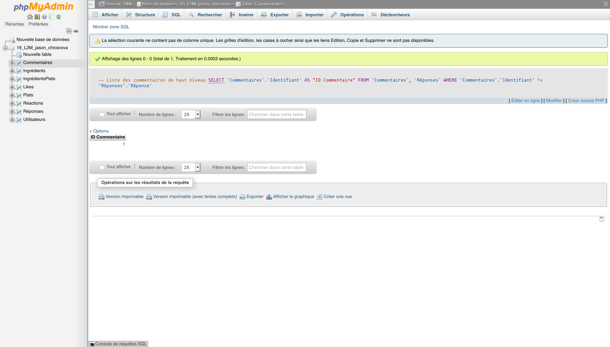
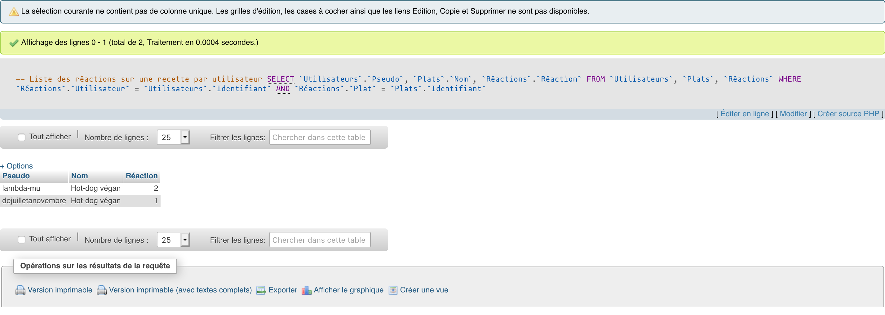
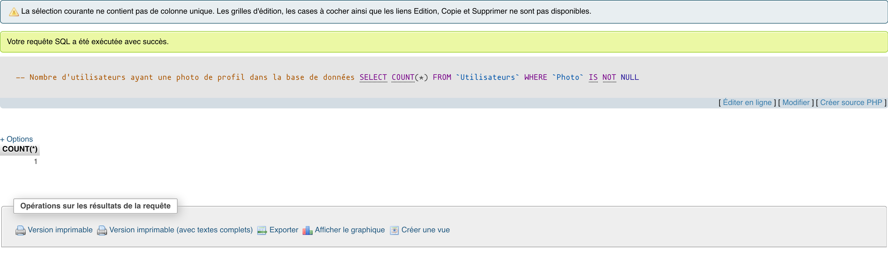
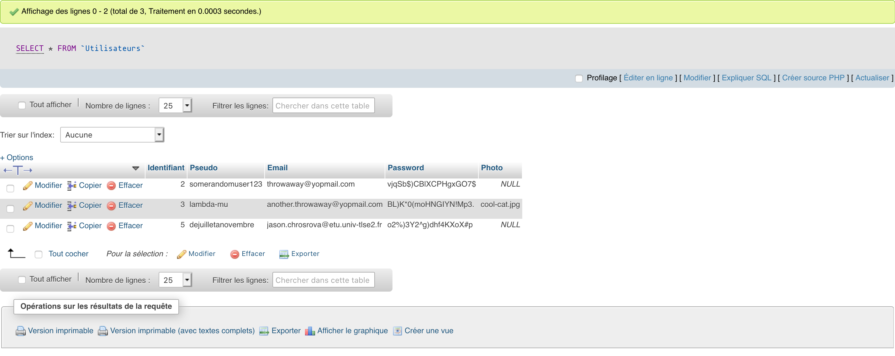
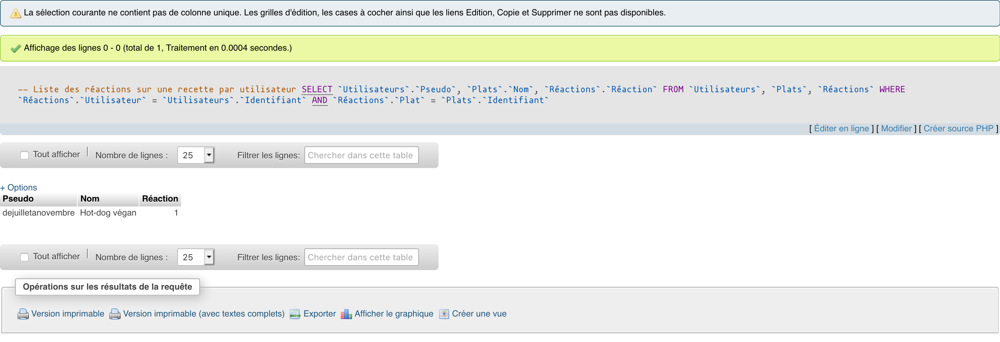

# Requêtes SQL

## Liste des commentaires de haut niveau

```mariadb
SELECT `Commentaires`.`Identifiant` AS "ID Commentaire"
FROM   `Commentaires`, `Réponses`
WHERE  `Commentaires`.`Identifiant` != `Réponses`.`Réponse`;
```

### Résultat



## Liste des réactions sur une recette par utilisateur

```mariadb
SELECT `Utilisateurs`.`Pseudo`, `Plats`.`Nom`, `Réactions`.`Réaction`
FROM   `Utilisateurs`, `Plats`, `Réactions`
WHERE  `Réactions`.`Utilisateur` = `Utilisateurs`.`Identifiant`
AND    `Réactions`.`Plat`        = `Plats`.`Identifiant`;
```

### Résultat



## Nombre d'utilisateurs ayant une photo de profil dans la base de données

```mariadb
SELECT COUNT(*)
FROM   `Utilisateurs`
WHERE  `Photo` IS NOT NULL;
```

### Résultat



## Anonymiser un utilisateur

```mariadb
UPDATE `Utilisateurs`
SET    `Pseudo` = NULL,
       `Email` = "",
       `Password` = ""
WHERE  `Pseudo` = "dejuilletanovembre";
```

### Résultat

#### Avant



#### Après



## Remettre à zéro les réactions d'un utilisateur sur une recette

```mariadb
DELETE FROM `Réactions`
WHERE       `Plat`        = (SELECT `Identifiant`
                             FROM   `Plats`
                             WHERE  `Nom` = "Hot-dog végan")
AND         `Utilisateur` = (SELECT `Identifiant`
                             FROM   `Utilisateurs`
                             WHERE  `Pseudo` = "lambda-mu");
```

### Résultats

#### Avant


#### Après


